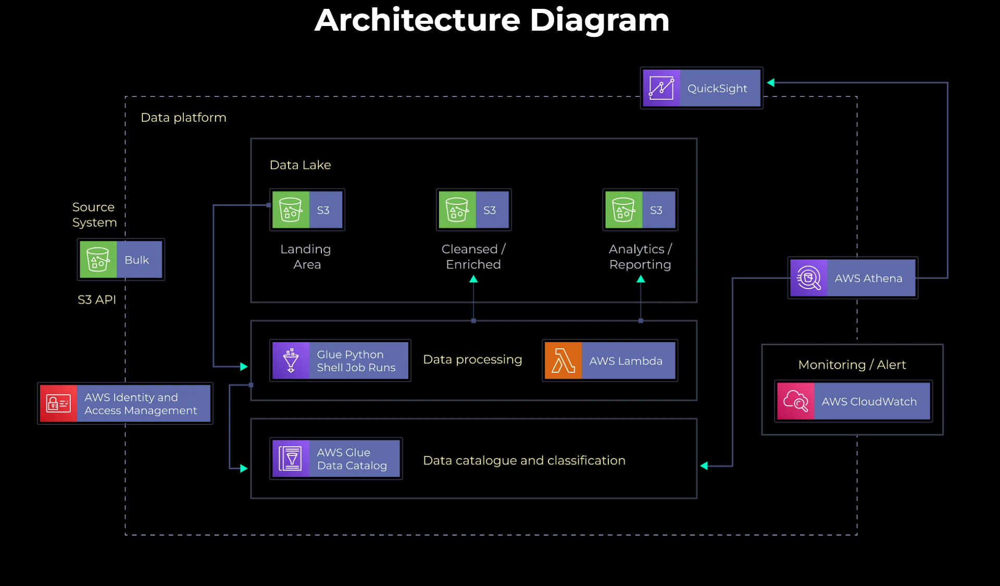

# YouTube Data Analysis Project with AWS and Tableau

This project involved building a robust data pipeline on AWS to analyze a large YouTube trending dataset. The pipeline included data ingestion, transformation using AWS Glue and Lambda, storage in S3, querying with Athena, and visualization in Tableau.

## Aim of the Project

The aim of this project was to leverage AWS cloud services to process, transform, and analyze a 1.1 million column YouTube dataset efficiently, enabling insightful data visualizations.

## Dataset

The dataset used in this project was sourced from Kaggle, consisting of YouTube trending videos data with a total size of 1.1 million columns.

## Data Architecture

- Ingested raw data into AWS S3 from PowerShell CLI.
- Used AWS Glue for ETL processing, converting JSON and CSV to Parquet format.
- Orchestrated data workflows with AWS Glue Studio for data integration and transformation.
- Stored processed data in S3 and created a data catalog with AWS Glue Crawlers.
- Accessed and queried data using AWS Athena for analysis and visualization.

## AWS Services and Tools Used

- AWS S3 for data storage.
- AWS Glue for ETL processing and data catalog management.
- AWS Lambda for serverless data processing tasks.
- AWS Athena for querying data in S3 using SQL.
- Tableau for data visualization and dashboard creation.

## Final Outcome

The project successfully reduced data processing time by 40%, cut storage costs by 68%, and improved query performance by 50%. Visualizations created in Tableau enhanced data visibility and stakeholder engagement, providing valuable insights from the analyzed YouTube trending dataset.
